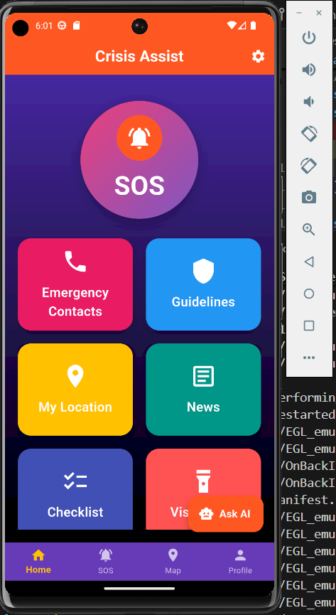
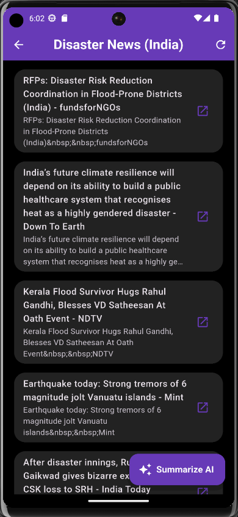
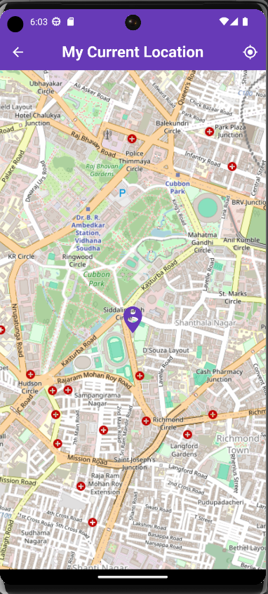
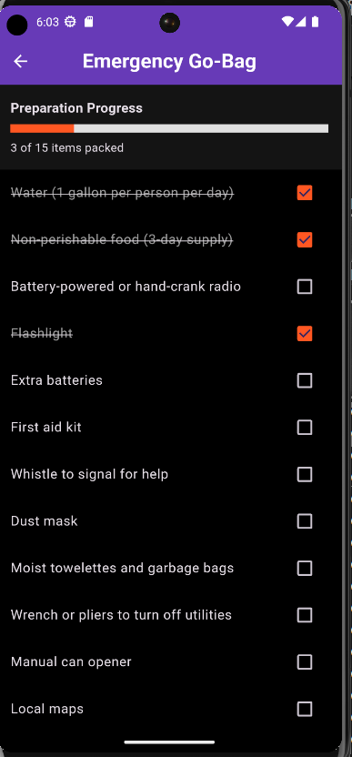
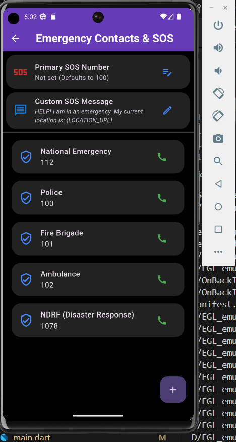

# Crisis Assist: AI-Powered Disaster Management 🚨

<p align="center">
  
  &nbsp;&nbsp;&nbsp;
  
  &nbsp;&nbsp;&nbsp;
  
</p>

Crisis Assist is a comprehensive, offline-capable Flutter application designed to save lives during emergencies and natural disasters. Built with an India-focus (supporting NDMA guidelines), it integrates real-time alerts, community-driven safety zones, and cutting-edge **Google Gemini AI** to provide calm, accurate, and actionable survival advice.

---

## 🌟 Key Features

### 🤖 Gemini AI Integration
*   **AI Disaster Assistant**: A built-in chat interface powered by **Gemini 2.5 Flash**. Ask for emergency guidance, and the AI will provide concise, panic-reducing instructions based on NDMA safety protocols.
*   **AI News Summarizer**: Extracts the latest disaster-related RSS feeds and uses Gemini to generate a 2-3 sentence actionable summary of the current threat level, helping you avoid misinformation and panic.

### 📍 Location & Safety Tracking
<p align="center">
  
</p>

*   **Community Safe Zones Map**: A map interface displaying your current location alongside potential safe zones and user-reported hazards (like floods or blocked roads).
*   **One-Tap SOS**: Instantly sends your location and an emergency message via SMS to default (112) or customized primary contacts.

### 🎒 Preparation & Offline Tools
<p align="center">
  
  &nbsp;&nbsp;&nbsp;
  
</p>

*   **Emergency Go-Bag Checklist**: An interactive, state-persistent checklist that tracks your progress in packing a 72-hour emergency survival kit.
*   **Visual SOS**: A distress signaling tool that rapidly flashes your device screen bright red and white to attract rescue workers in low-visibility environments.
*   **Offline Safety Guidelines**: Built-in instructions for responding to earthquakes, floods, and other emergencies without an internet connection.

---

## 🚀 Getting Started

### Prerequisites
*   Flutter SDK (3.0+)
*   Android Studio / Xcode
*   Google Gemini API Key

### Installation

1. **Clone the repository**
   ```bash
   git clone https://github.com/arunim123/disaster_manegement.git
   cd disaster_management_app
   ```

2. **Install dependencies**
   ```bash
   flutter pub get
   ```

3. **Configure the AI (Required)**
   Open `lib/services/ai_service.dart` and insert your Gemini API Key. Ensure your key has access to the `gemini-2.5-flash` model.
   ```dart
   static const String _apiKey = 'YOUR_API_KEY_HERE';
   ```

4. **Run the application**
   ```bash
   flutter run
   ```

## 🛠️ Built With
*   **[Flutter](https://flutter.dev/)** - UI Framework
*   **[Google Generative AI](https://pub.dev/packages/google_generative_ai)** - Gemini 2.5 Flash Integration
*   **[Geolocator](https://pub.dev/packages/geolocator)** & **[Flutter Map](https://pub.dev/packages/flutter_map)** - Maps and GPS tracking
*   **[Webfeed Plus](https://pub.dev/packages/webfeed_plus)** - RSS News Parsing
*   **[Shared Preferences](https://pub.dev/packages/shared_preferences)** - Local persistence

## 📄 License
This project is open-source and available under the MIT License.
